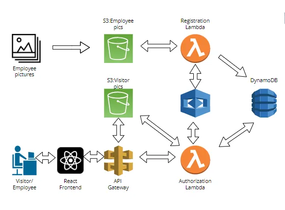

# Facial Recognition App on AWS

This project is a facial recognition application built using various AWS services, including Rekognition, Lambda, DynamoDB, API Gateway, and S3. The app detects and recognizes faces in images, stores metadata in DynamoDB, and allows interaction via a RESTful API. This README provides an overview of the project, setup instructions, and additional details for deployment and usage.

## Project Overview

The facial recognition app leverages the following AWS services:
- **AWS Rekognition**: Detects and recognizes faces in images.
- **AWS Lambda**: Processes image uploads, performs recognition, and stores metadata.
- **Amazon S3**: Stores images that are uploaded for recognition.
- **Amazon DynamoDB**: Acts as a NoSQL database for storing facial recognition metadata.
- **API Gateway**: Exposes RESTful API endpoints for users to interact with the app.

## Architecture

The architecture consists of the following components:
1. **S3 Bucket**: Stores images uploaded for recognition.
2. **Rekognition Collection**: Performs facial recognition and stores facial features.
3. **DynamoDB Table**: Stores user metadata and facial recognition details.
4. **Lambda Functions**: Handle image processing, recognition, and interaction with Rekognition and DynamoDB.
5. **API Gateway**: Provides an interface for API calls to the Lambda functions.

## Prerequisites

Before starting the setup, make sure you have:
1. An **AWS Account** with access to services (S3, Rekognition, Lambda, DynamoDB, API Gateway).
2. **AWS CLI** installed and configured on your local machine.
3. Proper **IAM roles and permissions** set up for Lambda, Rekognition, S3, and DynamoDB.
4. Familiarity with **Python or Node.js** for writing Lambda functions.

## Setup Instructions

### Step 1: Create an S3 Bucket
1. Go to the **S3 service** in the AWS Management Console.
2. Create a new bucket (e.g., `facial-recognition-bucket`).
3. Configure public access settings as needed.
4. Create folders within the bucket (e.g., `uploaded` for new images).

### Step 2: Configure Rekognition
1. Navigate to the **Rekognition service** in AWS.
2. Create a collection named `face-collection` to store facial data.
3. Set up IAM roles that allow Rekognition to interact with the S3 bucket.

### Step 3: Create a DynamoDB Table
1. Open **DynamoDB** in the AWS Console.
2. Create a new table named `FaceMetadata` with a primary key (`FaceId`).
3. Add additional attributes, such as `UserId`, `ImagePath`, and `Timestamp`.

### Step 4: Implement Lambda Functions
1. Create two Lambda functions: one for **image upload** and another for **facial recognition**.
2. The image upload function triggers when a new image is uploaded to S3, indexes the face using Rekognition, and stores metadata in DynamoDB.
3. The facial recognition function compares uploaded images against the `face-collection` and returns matching results.

### Step 5: Set Up API Gateway
1. Create a new **REST API** in the API Gateway.
2. Configure resources and methods, such as **POST /upload** and **GET /recognize**.
3. Integrate each method with the corresponding Lambda functions.
4. Deploy the API to a stage (e.g., `dev`).

### Step 6: Configure IAM Roles
1. Create IAM roles with permissions for **S3**, **Rekognition**, **Lambda**, and **DynamoDB**.
2. Attach these roles to your Lambda functions to grant access.

### Step 7: Testing the Application
1. Upload an image to the S3 bucket to trigger the Lambda function.
2. Test the recognition endpoint using **Postman** or a similar API client.
3. Verify that the recognition results are stored in DynamoDB.

## Additional Considerations

1. **Security**: Ensure proper configuration of IAM roles and policies to limit access.
2. **Logging and Monitoring**: Use **CloudWatch** for logging Lambda executions.
3. **Scalability**: Configure auto-scaling for high traffic scenarios.
4. **Error Handling**: Add error handling in Lambda functions to manage exceptions.

## Conclusion

The facial recognition app demonstrates how to integrate multiple AWS services to create a serverless application. By following the steps outlined above, you can build, deploy, and test a functional facial recognition system using AWS.

## License

This project is licensed under the MIT License. See the [LICENSE](LICENSE) file for details.

## Authors

- **Rohith Sabariram R**

## Contact

For questions or issues, please contact (mailto:rohithmahi7.com).